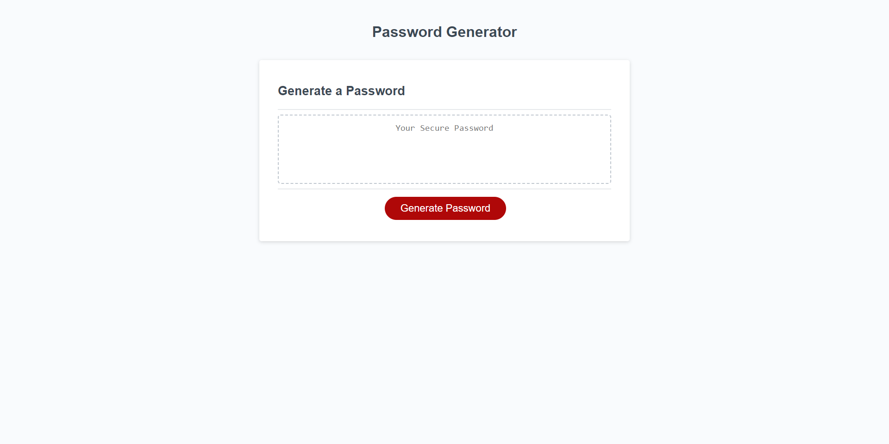
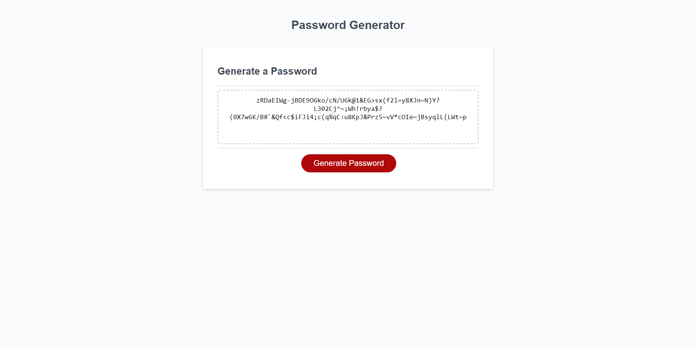

# 03-Password-Generator
This is my week 3 homework assignment where we made this password generator. 
This password generator can generate random passwords with 8 to 128 characters within. 
Special Characters that can be used: '`', '~', '!', '@', '#', '$', '%', '^', '&', '*', '(', ')', '_', '-', '=', '+', ':', ';', '<', '>', '/', '?' 
Numbers can be used also: 0 - 9 
And also any letter in the english alphabet can be used, lower and uppercase letters. 
When you go to generate your password, once you have clicked the generate password button, you will be asked a few questions. First question will be how many characters you will like you password to be. After you have made that selection, you will be asked if you will like to include special characters, then you will be asked if you will like to include numbers, and last two questions will ask if you will like to include uppercase letters and if you would like to include lowercase letters. After you made those selections your password will be generated. 
Link to deployed application: 
https://kgberry542.github.io/03-Password-Generator/ 

Screenshots of application: 
 
